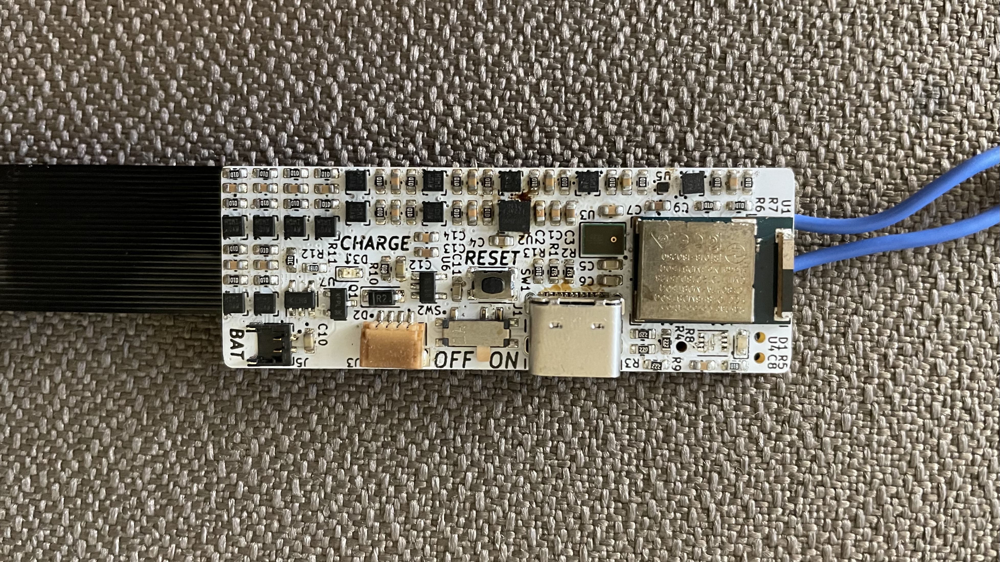
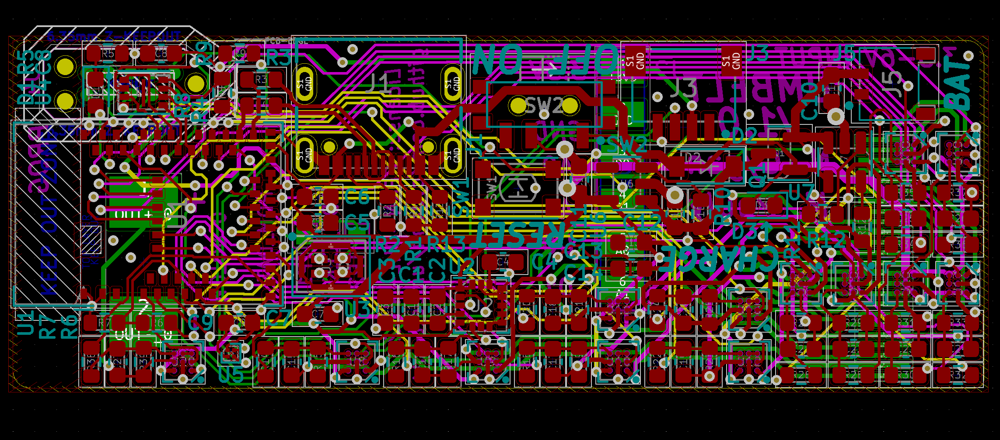

# umbelt-hw

This repo contains the hardware files for Umbelt: a sensory substitution belt
for everyday use. Designed to be worn around the waist underneath any belt,
Umbelt doesn't compromise on function or style. The name Umbelt (pronounced
"oom-belt") is a pun on the German word umwelt, used in English to describe an
organism's sensory environment and perceptions.

Sensory substitution "is a change of the characteristics of one sensory modality
into stimuli of another sensory modality."
([Wikipedia](https://en.wikipedia.org/wiki/Sensory_substitution))
This means that sensory modalities which are not otherwise accessible to an
individual can be recreated using haptic feedback on the waist. This includes
ordinary sensory functions for prosthetic purposes as well as sensory
information that is beyond typical human senses, such as electromagnetic
radiation outside the visible spectrum, the Earth's magnetic field, time,
physical proximity, velocity, or any other information in the computing world.

The initial configuration to try is the compass feature. This maps one's
absolute orientation to the waist by always indicating where north is whenever
the wearer's orientation changes. After wearing this for a while, the wearer
experiences subtle changes in spatial perception. It becomes more natural to
think in terms of absolute orientation, and separate locations become better
integrated into a larger, more continuous sense of space.

# Hardware Design

Umbelt is designed as an assembly of two printed circuits: a rigid printed
circuit board (PCB) and a flexible printed circuit (FPC). The board mounts all
of the electronic components: the microcontroller, power regulators, 13 motor
drivers, integrated sensors (magnetometer, accelerometer/gyroscope, and
microphone), and connectors. The flex PC connects to the board and wraps around
the wearer's waist, providing electrical connections to 12 of the 13 motors.

The Microcontroller is a Raytac MDBT50Q-1MV2 module based on the Nordic nRF52840
bluetooth microcontroller. This bluetooth connection enables phone-based
configuration of Umbelt. A Sparkfun/Adafruit-style Qwiic expansion connector
allows for the daisy-chaining of additional I2C sensors to Umbelt.

Schematics and layout were designed with KiCad version 5.1.10.

Schematics can be found [here](umbelt-board/umbelt-board.pdf).

# Related Repositories

[Software](https://github.com/cygann/umbelt-sw). Haptic effects, sensor
libraries, and user programs.

[Bootloader](https://github.com/cygann/Adafruit_nRF52_Bootloader). This
is a modified version of the Adafruit Feather nRF52840 Sense bootloader, and
that target is to be used when compiling and flashing.

# License

_Creators' note: The aim of this license is to be semi-permissive: Umbelt may
be used in larger projects under different licenses but Umbelt itself and
modifications to it must be open-source under the same license. Refer to license
text for specifics._

Copyright Natalie Cygan and Matthew Pauly 2021.

This source describes Open Hardware and is licensed under the CERN-OHL-W v2 or
later

You may redistribute and modify this documentation and make products
using it under the terms of the CERN-OHL-W v2 (https://ohwr.org/cernohl).
This documentation is distributed WITHOUT ANY EXPRESS OR IMPLIED
WARRANTY, INCLUDING OF MERCHANTABILITY, SATISFACTORY QUALITY
AND FITNESS FOR A PARTICULAR PURPOSE. Please see the CERN-OHL-W v2
for applicable conditions.

Source location: https://github.com/cygann/umbelt-hw
